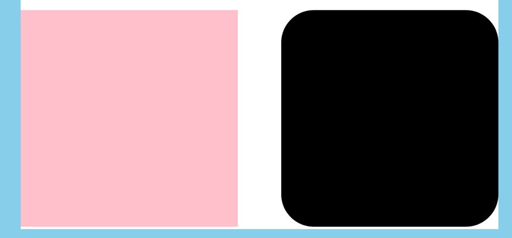
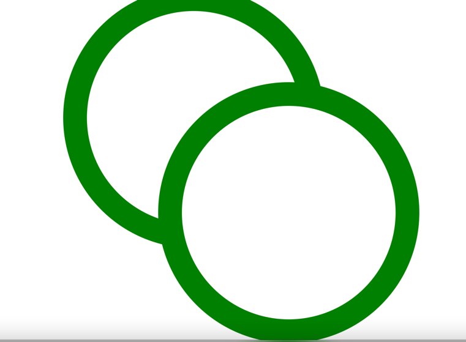

## Circle<br/>

:아래 외에 storke 등의 스타일링을 추가해줄 수 있습니다.
<br/> 그래프에서 scatter chart 그릴 때 종종 사용합니다.

```html
<svg>
    <circle r="22" cx="100" cy="100"></circle>
    <circle r={반지름의 길이} cx=={x 좌표} cy={y 좌표}></circle>
</svg>
```

브라우저에서 x,y 좌표는 왼쪽 위쪽이 (0,0) 이라고 생각하면 된다.

## rect 태그는<br/>

: 막대그래프를 그릴때 사용한다. x,y는 절대적인 위치를 의미하고, width, heigth는 속성명 그대로이다. <br/>

* rx : The horizontal corner radius of the rect. Defaults to ry if it is specified.
* ry : The vertical corner radius of the rect. Defaults to rx if it is specified.
  <br/>



## Path <br/>

path를 잘쓰는 방법은 d 속성을 얼마나 잘 이해하느냐에 달렸다.<br/>
🚨주의🚨<br/>
document에서 x,y 기준점은 현실세계의 그래프와 달리 , 브라우저 좌측 상단 모서리 지점이다. y값은 좌측 모서리로부터의 거리이므로, y값을 수치 그대로 넣게되면 우리 현실세계에서의 그래프와는 상하가 반대인
그래프 모양이 그려지게 된다. 그래서 캔버스 높이에서 데이터값을 빼서 y값을 만든다. ++)D3에서는 Scale을 통해 이 값을 변환해주는 방식이 더 많이 사용된다.

* MoveTo: M, m <br/>
    * M: Move the current point to the coordinate x,y. <br/>절대적인 x,y좌표로 이동시킨다.<br/>
    * m: Move the current point by shifting the last known position of the path by dx along the x-axis and by dy along
      the y-axis.
      <br/>즉, Pn = {xo + dx, yo + dy} 즉, 현재 경로에서 x, y 좌표만큼 이동시킨다.
* LineTo: L, l, H, h, V, v <br/>

* Cubic Bézier Curve: C, c, S, s
* Quadratic Bézier Curve: Q, q, T, t
* Elliptical Arc Curve: A, a
* ClosePath: Z, z

```html

<path d="M 10,10 l 80,80 v -80 h -40" stroke="blue" fill="none"></path>
```

* 10, 10 까지 이동(시작)
* 현재 좌표에서 80, 80만큼 이동 (웹 상에서는 반전되어 보인다)
* 현재 좌표에서 수직 -80만큼 이동
* 현재 좌표에서 수평 -40만큼 이동

```html

<g></g>
```

다른 svg element들을 group하는데 사용하는 태그입니다. g에 준 태그들은 자식 태그들에게 상속됩니다. 편리하죠!



```html
<svg viewBox="0 0 100 100" xmlns="http://www.w3.org/2000/svg">
    <!-- Using g to inherit presentation attributes -->
    <g fill="white" stroke="green" stroke-width="5">
        <circle cx="40" cy="40" r="25"/>
        <circle cx="60" cy="60" r="25"/>
    </g>
</svg>
```