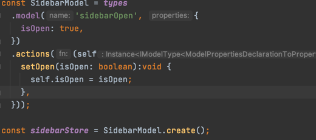
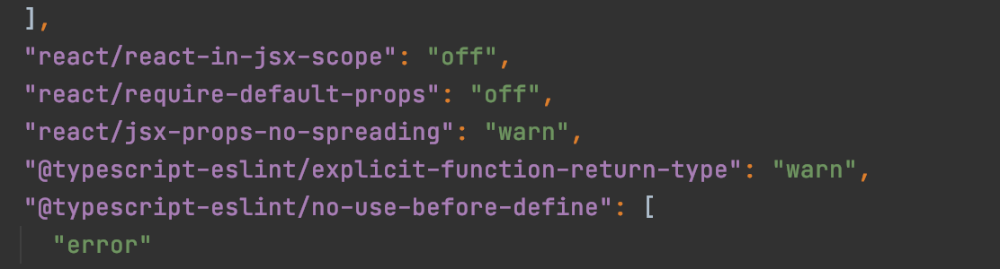

1. `yarn add mobx mobx-react mobx-state-tree`
2. _store 에서  사진과는 다르게 코드 상단에 eslint 무시하는것과, lint파일에서  wran 으로 바꾸셨다...
3. mst가 쓰이는 곳에서는 해당 컴포넌트를 `observer`로 묶어줘야한다. (mobx-react)
4. view의 경우 vue의 compute처 계산된데이터...?